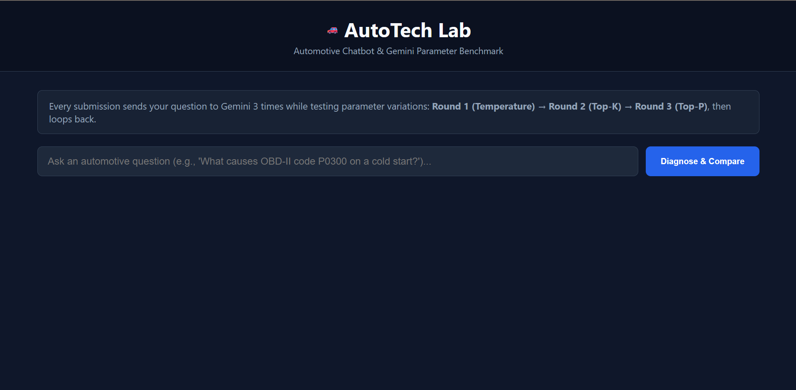
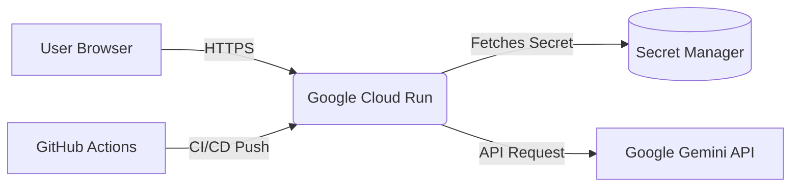

# AutoTech Lab: Automotive Diagnostic Chatbot & LLM Parameter Benchmark



AutoTech Lab is a specialized Flask-based web application powered by Google's Gemini API. It serves a dual purpose: acting as an expert automotive diagnostic assistant, and functioning as a live sandbox to test and observe how different Large Language Model (LLM) hyperparameters affect AI responses.

## 🚀 Features

- **Automotive Diagnostic Assistant**: Instructed to provide technical, safe, and actionable insights on vehicle troubleshooting, engine performance, electrical systems, and maintenance specs.
- **Live Parameter Benchmarking**: Every time you submit a question, the application generates **three parallel responses** using different parameter values, allowing you to directly compare the outputs side-by-side.
- **Round-Robin Experimentation**: The app cycles through three testing rounds automatically:
  - **Round 1 (Temperature)**: Tests Determinism vs. Creativity `(0.0, 0.5, 1.0)`
  - **Round 2 (Top-K)**: Tests Token Candidate Filtering `(3, 5, 20)`
  - **Round 3 (Top-P)**: Tests Nucleus Sampling Thresholds `(0.1, 0.6, 0.95)`
- **Token Usage Breakdown**: Transparently displays the exact token cost for every API call, split by Prompt Tokens and Output Tokens.

## 🛠️ Tech Stack
- **Backend**: Python, Flask
- **AI Model**: Google Gemini API (`gemini-3.6-flash` via the unified `google-genai` SDK)
- **Frontend**: HTML5, Vanilla JavaScript, CSS3

## ⚙️ Setup & Installation

1. Clone the repository:
   ```bash
   git clone https://github.com/skumar6257/Automotive_Chatbot.git
   cd Automotive_Chatbot
   ```

2. Set up a Python Virtual Environment:
   ```bash
   python -m venv venv
   # On Windows:
   .\venv\Scripts\activate
   # On Mac/Linux:
   source venv/bin/activate
   ```

3. Install dependencies:
   ```bash
   pip install flask python-dotenv google-genai
   ```

4. Configure Environment Variables:
   - Rename `.env.example` to `.env`
   - Add your Gemini API Key:
     ```env
     GEMINI_API_KEY=your_actual_api_key_here
     ```

5. Run the application (Choose Option A or B):

   **Option A: Run using Python directly**
   ```bash
   python app.py
   ```

   **Option B: Run using Docker (Recommended)**

   Build the Docker image:
   ```bash
   docker build -t auto-chatbot:v1 .
   ```

   Run the Docker image:
   ```bash
   docker run -d -p 5000:5000 --env-file .env --name chatbot-container auto-chatbot:v1
   ```
   Navigate to `http://localhost:5000` in your browser.

## 🧪 Testing

This project uses `pytest` and `unittest.mock` to perform automated unit tests without incurring Gemini API costs.

To run the test suite locally:
```bash
pytest test_app.py -v
```

## ☁️ CI/CD & Deployment

This project features a fully automated enterprise-grade CI/CD pipeline using **GitHub Actions**.

- **Push to Main:** Triggers the `.github/workflows/deploy.yml` pipeline.
- **Testing Gate:** Runs `pytest`. If tests fail, deployment is aborted.
- **Security:** Uses **Workload Identity Federation (OIDC)** for keyless authentication with Google Cloud.
- **Artifact Registry:** Builds and pushes the Docker container securely.
- **Cloud Run Deployment:** Deploys the image to Google Cloud Run (Serverless) using an API key securely injected via **Google Secret Manager**.
- **Smoke Testing:** Performs an automated post-deployment `curl` ping to verify the live URL is healthy.

## 🏗️ System Architecture


